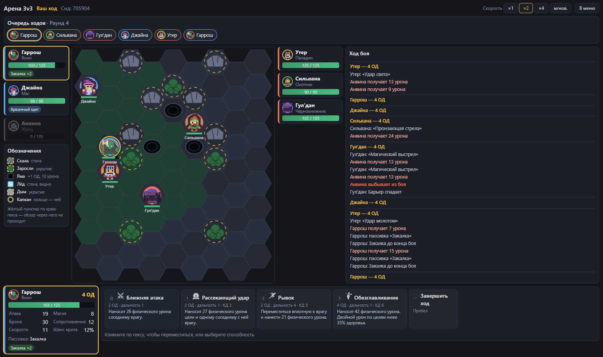
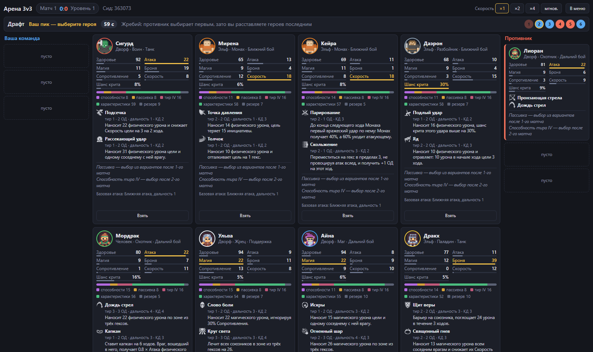

<div align="center">

# ⚔️ Fantasy Brawl — Арена 3v3

**Браузерный тактический арена-баттлер в фэнтези-сеттинге.**
Собери команду из трёх героев на драфте, расставь их на гексагональной арене
и выиграй серию матчей до трёх побед.

[](https://github.com/Mokriza/FantasyBrawl/actions/workflows/deploy.yml)


**[▶ Играть в браузере](https://mokriza.github.io/FantasyBrawl/)**



</div>

## Об игре

Два игрока по очереди выбирают героев из общего пула, расставляют их на поле 9×9 и сражаются
в пошаговом бою. Кто ходит следующим, решает шкала инициативы (ATB): быстрые герои ходят чаще.
В свой ход у героя 4 очка действия (ОД) на перемещение и способности. Серия идёт до трёх побед.
Между матчами герои растут в уровне, выбирают перки, а после первых двух матчей открывают
пассивку и способность высшего тира. Поэтому состав можно подстраивать под противника.

Сейчас играем против ИИ. Позже появятся онлайн-PvP и порт на Godot.



### Забег

1. **Драфт.** Пул из 10 сгенерированных героев, змейка пиков `A B B A A B`, 60 секунд на выбор.
   Все герои генерируются на одинаковый бюджет очков: «самого сильного» в пуле нет, есть самый
   удобный под план.
2. **Расстановка.** Стороны по очереди ставят героев в свою стартовую зону.
3. **Бой.** Пошаговый, на гексах: зона контроля и атаки по возможности, линия видимости,
   местность (скалы, заросли, ямы, лёд, дым, капканы), статусы и призывы.
4. **Фаза усиления.** Новый уровень, перк на выбор из трёх, а после 1-го и 2-го матча —
   открытие пассивки и способности тира IV.
5. Повторяем, пока одна из сторон не наберёт **три победы**.

### Классы

| Класс | Роль | Главная характеристика | Стиль |
|---|---|---|---|
| 🛡️ **Воин** | Танк-боец | Атака | Врезается в строй, держит зону контроля |
| ✨ **Паладин** | Танк-опора | Броня | Гибрид: защита союзников, лечение и урон светом |
| 🏹 **Охотник** | Дальний урон | Атака | Выстрелы на дистанции, капканы, метка на цель |
| 🔮 **Маг** | Дальний урон по площади | Магия | Огненные шары, цепная молния, стены льда, метеор |
| ✝️ **Жрец** | Поддержка | Магия | Лечение, обереги, немота |
| 💀 **Чернокнижник** | Поддержка | Магия | Порча, чума, призыв беса, пакт крови |
| 🗡️ **Разбойник** | Бурст ближнего боя | Шанс крита | Невидимость, удары в спину, охота на одиночек |
| 👊 **Монах** | Мобильный боец | Скорость | Скольжение, парирование, конус «Вихря ветра» |

У каждого класса пул из 10 способностей по четырём тирам и 3–4 пассивки. Генератор берёт
случайный набор, так что два героя одного класса играются по-разному.

### В цифрах

- **8** классов, **80** способностей, **25** пассивок
- **4** расы, **30** перков, **27** статусов
- ИИ на полезности (utility AI) для боя, драфта, расстановки и выбора перков

## Быстрый старт

Нужен [Node.js](https://nodejs.org/) 20+.

```bash
npm install
npm run dev
```

Откройте адрес, который выведет Vite (обычно `http://localhost:5173`), и выберите
**«Новый забег»** или **«Быстрый бой»** готовыми командами.

### Управление в бою

| Клавиша | Действие |
|---|---|
| `1`–`3` | Выбрать способность |
| `Q` | Базовая атака |
| `Пробел` | Завершить ход |
| `Esc` | Отменить выбор |

Клик по гексу — переместиться или применить выбранную способность. При наведении видна
стоимость пути в ОД и превью урона.

## Команды

```bash
npm run dev               # dev-сервер Vite
npm run build             # прод-сборка
npm run typecheck         # tsc --noEmit
npm run lint              # ESLint, включая запрет импортов в core
npm test                  # Vitest, однократно
npm run test:watch        # Vitest в watch-режиме
npm run validate-content  # проверить весь JSON контента по схемам и правилам пулов
npm run sim -- --matches 1000 --seed 42          # балансная симуляция боёв в Node
npm run sim -- --mode draft --runs 100 --seed 1  # целые забеги ИИ против ИИ
```

## CI и деплой

Каждый push и pull request проходит [CI](.github/workflows/ci.yml): typecheck, lint, проверка контента, тесты и сборка. Push в `master` после зелёного CI публикует игру на GitHub Pages ([deploy.yml](.github/workflows/deploy.yml)). Сайт живёт в подпапке `/FantasyBrawl/`: сборка получает её через переменную `BASE_PATH`, а пути к картинкам из контента дополняет `src/ui/assets/url.ts`.

## Архитектура

```
src/
  core/      чистые правила игры: без DOM, React, Pixi, Math.random и Date
  content/   JSON: классы, способности, пассивки, перки, расы, статусы, config
  ai/        utility AI для боя, драфта, расстановки и перков; зависит только от core
  sim/       headless-прогон матчей и забегов для баланса, запускается в Node
  ui/        React (панели) + PixiJS (игровое поле); единственное место с браузером
docs/
  GAMEDESIGN.md  геймдизайн-документ
  ai/            техническая документация: правила, схемы, архитектура, roadmap
```

Принципы, на которых держится проект:

- **Ядро детерминировано.** Вся случайность идёт через сидированный генератор, который
  хранится в состоянии. Один сид — один и тот же бой. На этом держатся тесты и симуляция
  баланса, и это задел для онлайна.
- **Состояние неизменяемо.** `applyAction(state, action)` возвращает новое состояние и
  список событий. Интерфейс анимирует события, а не сравнивает состояния.
- **Один источник правды о допустимых действиях** — `legalActions(state)`. И интерфейс,
  и ИИ спрашивают его, а не держат свою копию правил.
- **Контент — данные.** Новая способность — это запись в JSON из готовых «атомов» эффектов
  (урон, лечение, статус, телепорт, призыв, местность и т. д.), а не новый код.
  Все числа баланса живут в `src/content/config.json` и JSON контента.

## Документация

| Тема | Документ |
|---|---|
| Геймдизайн (экспорт из Word) | [docs/GAMEDESIGN.md](docs/GAMEDESIGN.md) |
| Правила: формулы, ATB, ОД, статусы, забег | [docs/ai/game-rules.md](docs/ai/game-rules.md) |
| Архитектура и поток данных | [docs/ai/architecture.md](docs/ai/architecture.md) |
| Схема контента: способности, пассивки, перки | [docs/ai/content-schema.md](docs/ai/content-schema.md) |
| Гексагональная сетка | [docs/ai/hex-grid.md](docs/ai/hex-grid.md) |
| ИИ противника | [docs/ai/ai-opponent.md](docs/ai/ai-opponent.md) |
| Тесты и симуляция баланса | [docs/ai/testing-and-simulation.md](docs/ai/testing-and-simulation.md) |
| Интерфейс и отрисовка | [docs/ai/ui-and-rendering.md](docs/ai/ui-and-rendering.md) |
| Журнал балансировки | [docs/ai/balance-log.md](docs/ai/balance-log.md) |
| Этапы разработки | [docs/ai/roadmap.md](docs/ai/roadmap.md) |

## Статус

| Этап | Что | Статус |
|---|---|---|
| 0 | Каркас: TypeScript, ESLint, Vitest, схемы контента | ✅ |
| 1 | Играбельный бой 3v3 против ИИ | ✅ |
| 2 | Забег: генерация героев, драфт, расстановка, серия до трёх побед | ✅ |
| 3 | Весь контент: 8 классов, пассивки, расы, перки, открытия между матчами | ✅ |
| 4 | Полный цикл: артефакты, награды, замена героя, модификаторы арены | 🔜 |
| 5 | Балансировка по данным симуляции, профили сложности ИИ | ⏳ |
| 6 | Полировка: ассеты, анимации, звук | 🟡 частично |

## Ассеты

- Фигурки героев — [Kenney](https://kenney.nl): *Tiny Dungeon* и *Roguelike Characters* (CC0).
- Иконки способностей — [game-icons.net](https://game-icons.net) (CC BY 3.0), авторы Lorc,
  Delapouite и Sbed.

Полный список с лицензиями и атрибуцией — в [ASSETS.md](ASSETS.md).
